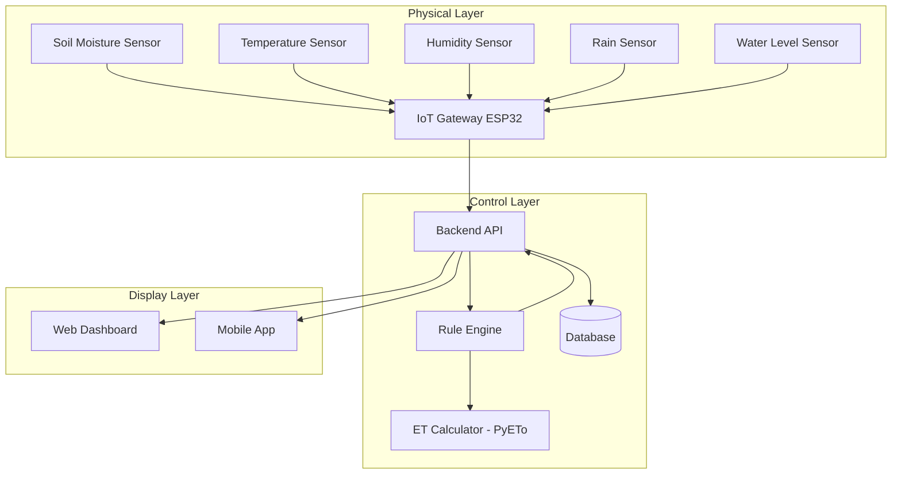

# **System Architecture — Smart Irrigation System**

## **1. Overview**

The system is divided into **three main layers**:

1. **Physical Layer (Sensors + IoT Devices)**
   Reads soil moisture, temperature, humidity, light, rainfall, water level, etc.

2. **Control Layer (Backend + Rule Engine + Scheduler + ET Calculator)**
   Processes sensor data and decides irrigation timing & water quantity.

3. **Display Layer (Frontend Dashboard + Mobile App + Reports)**
   Shows metrics, charts, logs, and system actions.

---

## **2. Architecture Flow Diagram (Text-Based)**

---

## **3. Component Explanation**

### **Physical Layer**

| Component                     | Function                            |
| ----------------------------- | ----------------------------------- |
| Soil Moisture Sensor          | Measures water content in soil      |
| Temperature & Humidity Sensor | Helps calculate ET values           |
| Rain Sensor                   | Reduces irrigation when raining     |
| Water Level Sensor            | Prevents irrigation when tank empty |
| ESP32 IoT Gateway             | Sends data → backend via REST/ MQTT |

---

### **Control Layer**

| Component         | Function                                 |
| ----------------- | ---------------------------------------- |
| **Backend API**   | Receives sensor data & exposes endpoints |
| **Rule Engine**   | Decides ON/OFF irrigation & water amount |
| **ET Calculator** | Computes evapotranspiration using PyETo  |
| **Database**      | Stores logs, sensor history, predictions |

---

### **Display Layer**

| Component         | Function                             |
| ----------------- | ------------------------------------ |
| **Web Dashboard** | Charts, live values, irrigation logs |
| **Mobile App**    | Notifications, control buttons       |
| **Reports**       | Weekly/Monthly water consumption     |

---

## **4. Data Flow Summary**

1. Sensors collect readings every X minutes
2. ESP32 sends data → Backend
3. Backend saves data → DB
4. Rule Engine checks thresholds, ET values
5. Decision:

   * **Irrigate now**
   * **Delay irrigation**
   * **Skip irrigation**
6. Dashboard receives data → Graphs & real-time update

---

## **5. Future Enhancements**

* ML-based irrigation prediction
* Multi-field support
* Weather API integration
* Automatic anomaly detection
