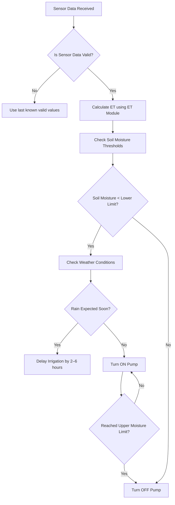

# Rule Engine – Logic, Flowchart & Decision Matrix

## 1. Overview

The Rule Engine decides:

- When irrigation should turn **ON**
- When it should turn **OFF**
- Which **pump mode** to use (Auto / Manual)
- How to use ET (Evapotranspiration) + soil moisture + weather forecast.

This document defines the logic clearly for developers, testers, and stakeholders.

---

## 2. High-Level Logic Flow



---

## 3. Decision Matrix

| Condition                  | Moisture       | ET          | Rain Forecast | Action                     |
| -------------------------- | -------------- | ----------- | ------------- | -------------------------- |
| Dry soil, no rain coming   | < LowerLimit   | High        | No            | **Start irrigation**       |
| Dry soil but rain expected | < LowerLimit   | Medium/High | Yes           | **Delay irrigation**       |
| Moisture in normal range   | Between limits | Any         | Any           | **No irrigation (turn OFF if ON)**            |
| High moisture              | > UpperLimit   | Low         | Any           | **Stop irrigation**        |
| Sensor error               | N/A            | N/A         | N/A           | **Use last valid reading** |

---

## 4. Thresholds

Default recommended values:

| Parameter                  | Value          |
| -------------------------- | -------------- |
| Soil Moisture Lower Limit  | 30%            |
| Soil Moisture Upper Limit  | 70%            |
| Temperature Range Validity | 0–55°C         |
| ET High Level              | > 4.0 mm/day   |
| ET Medium                  | 2.0–4.0 mm/day |
| ET Low                     | < 2.0 mm/day   |


> **Note for Technicians / Developers:**  
> These thresholds are defined in `rule-engine/engine.py` as constants:  
> `LOWER_LIMIT = 30` and `UPPER_LIMIT = 70`.  
> To adjust, edit these values and restart the backend.


---

## 5. Rule Engine Pseudocode

```python
def rule_engine(data, last_state):
    moisture = data["soil_moisture"]
    temp = data["temperature"]        # TS
    humidity = data["humidity"]       # HS
    light = data.get("light_level", 0) # LS, default 0 if missing
    et = data["et_value"]
    rain = data["rain_forecast"]
    pump_state = last_state["pump"]

    # 1. Validate incoming data
    if not data["valid"]:
        return last_state  # keep old state

    # 2. Check all sensor ranges
    if not (0 <= temp <= 55) or not (0 <= humidity <= 100) or not (0 <= light <= 1000):
        return last_state  # sensor error fallback

    # 3. Soil moisture rules
    if moisture < LOWER_LIMIT:
        if rain:
            return {"pump": "DELAY", "reason": "Rain expected"}
        return {"pump": "ON", "reason": "Soil dry"}

    if LOWER_LIMIT <= moisture <= UPPER_LIMIT:
        return {"pump": "OFF", "reason": "Moisture OK"}

    if moisture > UPPER_LIMIT:
        return {"pump": "OFF", "reason": "Soil too wet"}

    return last_state


```

---

## 6. Historical Data Testing (Back-Testing)

You must verify rule engine performance using previous season data.

### Steps:

1. Load CSV of historical moisture + ET + rain forecast.
2. Run rule engine across each day.
3. Log pump ON/OFF decisions.
4. Compare with farmer’s real irrigation patterns.
5. Adjust thresholds if system is too aggressive or too conservative.

Example back-test skeleton:

```python
import pandas as pd

df = pd.read_csv("historical_data.csv")
state = {"pump": "OFF"}

for _, row in df.iterrows():
    decision = rule_engine(row, state)
    print(row["date"], decision)
    state = decision
```

---

## 7. Outputs the Rule Engine Must Produce

| Field         | Description                |
| ------------- | -------------------------- |
| pump          | ON / OFF / DELAY           |
| reason        | Why the decision was taken |
| timestamp     | Server time                |
| inputs_used   | Sensors + ET values        |
| safety_checks | Validation results         |

---

## 8. Error Handling

- Missing sensor data → fallback to cached values.
- ET module failure → retry 3 times then use last ET value.
- Weather API down → run without forecast.
- Sensor out of bounds (example: moisture > 100%) → mark invalid.

---

## 9. Future Improvements

- ML-based irrigation prediction model.
- Threshold auto-learning per crop type.
- Multi-zone irrigation rules.
- Fuzzy logic decision-making.
